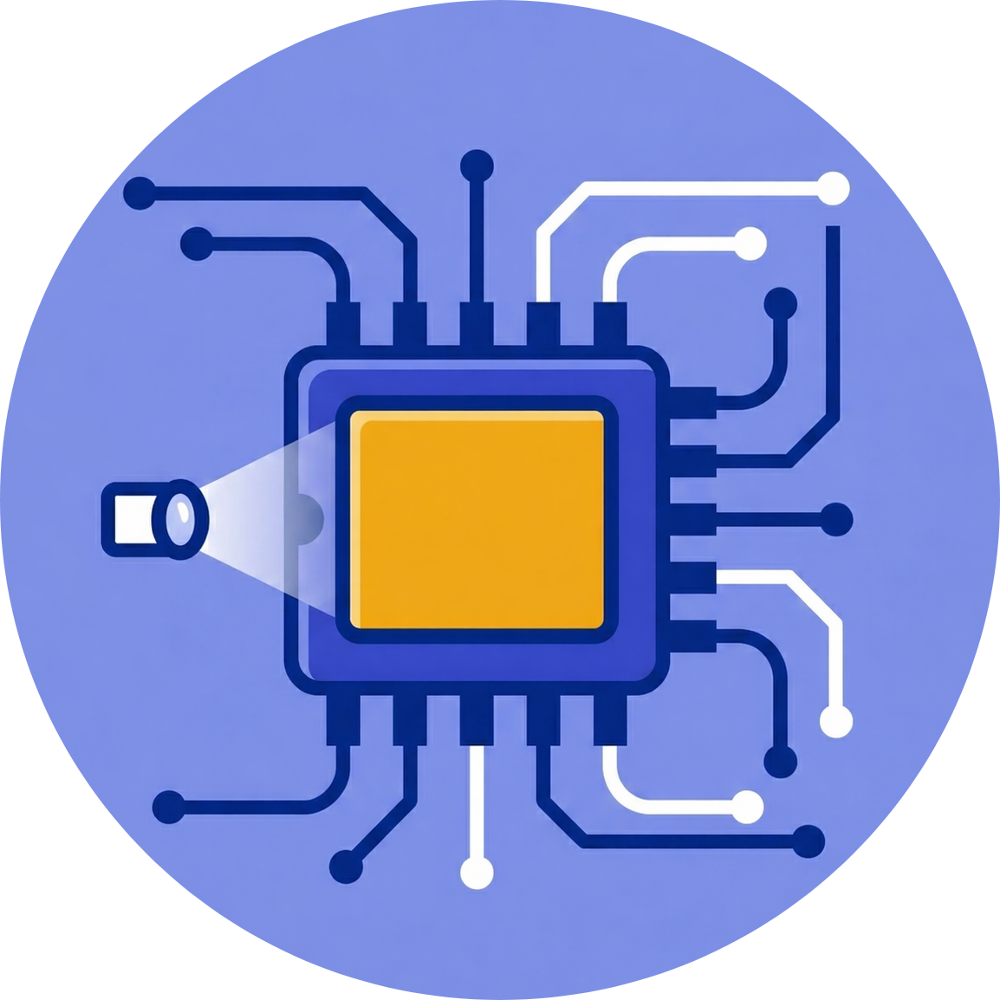

<div align="center">
  
  <h1>ProtoSpark</h1>
  <p><strong>The AI-Powered Hub for Electronics Enthusiasts & Makers</strong></p>

  [](https://nextjs.org)
  [](https://tailwindcss.com)
  [](https://orm.drizzle.team)
  [](LICENSE)
</div>

---

## ⚡ What is ProtoSpark?

**ProtoSpark** is a next-generation platform designed for hardware hackers, electronics engineers, and hobbyist makers. It combines robust **Inventory Management** with **AI-Assisted Project Documentation** and a vibrant **Social Community**.

Built with a striking **Brutalist Aesthetic**, ProtoSpark is as bold as the projects you're building.

## ✨ Core Features

### 🔍 AI-Powered Component Scanning
Stop typing manual MPNs. Take a photo of your component drawer or a specific PCB, and ProtoSpark's Gemini-powered engine will identify, categorize, and log your inventory automatically.

### 🛠️ Brutalist Project Documentation
Create beautiful, high-contrast project guides.
- **Mermaid.js Integration**: Generate and render schematics and flowcharts directly in your docs.
- **Safety First**: Automated safety warnings and difficulty levels for every project.
- **Component Linking**: Automatically track which parts from your inventory are needed for each build.

### 🌐 Social Maker Hub
- **Public Profiles**: Showcase your lab and your latest builds.
- **Project Blogging**: Share your progress, challenges, and successes with the community.
- **Collaboration**: Like, comment, and fork projects from other makers.

### 📦 Smart Inventory
Track your generic resistors, specialized ICs, and everything in between with a system that understands electronics units (Ω, F, H) and categories.

## 🛠️ Tech Stack

- **Framework**: [Next.js 16](https://nextjs.org/) (App Router, Turbopack)
- **Styling**: [Tailwind CSS 4](https://tailwindcss.com/) & [shadcn/ui](https://ui.shadcn.com/)
- **Database**: [PostgreSQL](https://www.postgresql.org/) via [Neon](https://neon.tech/) & [Drizzle ORM](https://orm.drizzle.team/)
- **Auth**: [Auth.js v5](https://authjs.dev/)
- **AI**: [Google Gemini SDK](https://ai.google.dev/) & [Vercel AI SDK](https://sdk.vercel.ai/)
- **Animations**: [GSAP](https://gsap.com/), [Framer Motion](https://www.framer.com/motion/), & [Lenis](https://lenis.darkroom.engineering/)
- **Visuals**: [Mermaid.js](https://mermaid.js.org/), [Phosphor Icons](https://phosphoricons.com/)

## 🚀 Getting Started

1. **Clone the repo**
   ```bash
   git clone https://github.com/your-username/protospark.git
   ```

2. **Install dependencies**
   ```bash
   pnpm install
   ```

3. **Configure Environment Variables**
   Create a `.env` file based on `.env.example`:
   ```env
   DATABASE_URL=your_postgres_url
   GOOGLE_GENERATIVE_AI_API_KEY=your_key
   AUTH_SECRET=your_secret
   ```

4. **Initialize Database**
   ```bash
   pnpm drizzle-kit push
   ```

5. **Fire it up!**
   ```bash
   pnpm dev
   ```

## 🎨 Design Philosophy

ProtoSpark isn't just another SaaS template. It's built with a **Brutalist UI** focus:
- **Sharp Edges**: No rounded corners. Precision matters.
- **Bold Borders**: 2px-4px borders for that industrial feel.
- **Neo-Brutalism**: Vibrant accent colors against a stark dark/light background.

## 🤝 Contributing

We love contributions! Check out our [CONTRIBUTING.md](CONTRIBUTING.md) to get started.

## 📄 License

ProtoSpark is open-source software licensed under the [MIT License](LICENSE).

---

<div align="center">
  Built with ⚡ by makers, for makers.
</div>
